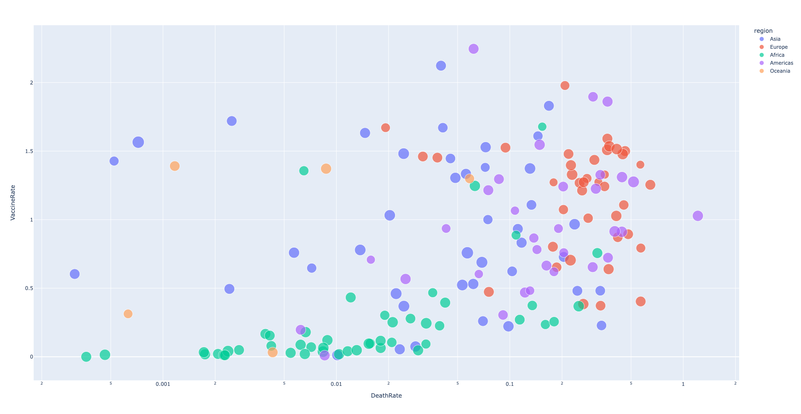

# Covid-19 Trend Analysis
In this exploratory project, I analyze a time series dataset on COVID-19 and explore the effects of vaccinations against the disease on the confirmed number of cases and deaths. I conduct the analysis on the 50 U.S. states, as well as 280 countries around the world. I create interactive visualizations of these datasets, as below.

## Data
The datasets are retrieved from the COVID-19 Data Repository by the Center for Systems Science and Engineering (CSSE) at Johns Hopkins University (https://github.com/CSSEGISandData/COVID-19).

## Tools
Python (Pandas, Plotly, Numpy)

## Summary
The 5 plots can be viewed, interactively, with the html files under "output."

To begin with, I created a plot of the daily number of confirmed cases in the U.S., by state and as a country. 
Below is a screenshot of the plot (an interactive plot is available under "output"). The plot shows multiple waves of cases since around March 2020 until November 2021. We can see that some states including New York, Texas, Florida, and California have had more cases than other states, at various points during the pandemic. 

This plot shows a similar trend to the previous plot, suggesting more cases equals larger numbers of deaths. The states that experienced a high death rate corresponds to the states listed for the first plot. A significance difference is that, around the beginning of April 2020, the country experienced a much higher death rate for the number of comfirmed cases, compared to the other points of time during the pandemic. This might suggest how we were unprepared to spread and prevent the spread of the virus at the beginning of the pandemic.

Next, we'll look at the relationship between vaccine rollout and the number of comfirmed cases in the U.S. The plot tells us that despite the growing number of vaccinated population, the number of cases has increased significantly over the past few months. 

Studies have suggested that vaccines are most effective against preventing severe illness (). Then, we might expect to see a decreasing trend in the number of deaths as the vaccine rollout increases. In the plot below, we can somewhat observe such a trend. Although there has been a small increase in the number of deaths over that past 6 months, we have not reached anywhere near the peak that we experienced around April 2021, when vaccines had just begun to reach a large population in the U.S.

Similar to the previous plot, I've plotted Vaccine Rate vs. Death Rate for 280 countries around the world. Both rates are calculated as the ratio of the numbers of administered vaccines and deaths to the population of the country, from 04-01-21 to 10-31-21. 
For this plot, I use a bubblechart. The maximum vaccine rate is 4 because one person would get 2 doses of a vaccine. Each color of the bubble represents which continent a country lies in. For example, the Americas is purple. We can observe that most countries in the Americas have experienced high death rates, but many have relatively high vaccine rates. On the other hand, the overall vaccine rate seems the lowest for Africa, out of 5 continents. Many countries in Africa have also experienced very low death rates, while some very high such as Tunisia. Both rates vary widely among countries in Asia and Oceania. Most countries in Europe have both relatively high rates. 

